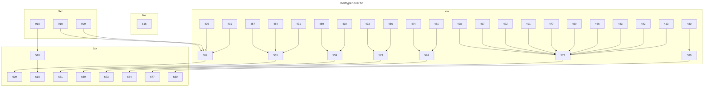

# Svenska nationella kort

Kort som utfärdas för att ha en specifik funktion i Sverige kallas "nationella kort", det som är gemensamt för dessa är att de har samma prefix och existerar i samma prefix-rymd.


```
9   Nationella utgivare
 752  ISO-3166-1 numerisk kod för SE och Sverige
     XXXX  Utgivarprefix (utdelas genom SIS)
```


I dagsläget verkar alla dessa siffror vara "okända" och "opublicerade", kanske genom "säkerhet och sekretess". Ingenting i samhället blir säkrare eller bättre av att man håller saker och ting hemliga i det öppna, dessa kort används för att identifiera individer.


## Observerade kort nummer och prefix

Dessa nummer är samlade från öppna källor på internet och sammanställda till nedan tabell.

| Pref |      | Issuer                         | Format                    |
| ---- | ---- | ------------------------------ | ------------------------- |
| 9752 | 2016 | Resurs Bank                    | `9752 2016 xxxx xxxx`     |
| 9752 | 2040 | ICA Förmåns- och Betalkort     | `9752 2040 xxxx xxxx`     |
| 9752 | 2046 | Ving Holiday Card              | `9752 2046 xxxx xxxx`     |
| 9752 | 2050 | ICA Förmånskort                | `9752 2050 xxxx xxxx`     |
| 9752 | 2094 | Lindex                         | `9752 2094 xxxx xxxx`     |
| 9752 | 2097 | SJ AB (Riksparkering, Årskort) | `9752 2097 xxxx xxxx`     |
| 9752 | 2102 | SJ AB, Medlemskort             | `9752 2102 xxxx xxxx`     |
| 9752 | 2112 | ICA AB                         | `9752 2112 xxxx xxxx`     |
| 9752 | 2129 | Brothers                       | `9752 2129 xxxx xxxx`     |
| 9752 | 2176 | Stadium                        | `9752 2176 xxxx xxxx`     |
| 9752 | 2198 | Posten ID-kort                 | `9752 2198 tmm xxxx xxxx` |
| 9752 | 2224 | Resurs Bank                    | `9752 2224 xxxx xxxx`     |
| 9752 | 2226 | Eurovip                        | `9752 2226 xxxx xxxx`     |
| 9752 | 2229 | Tullverket                     | `9752 2229 tmm xxxx xxxx` |
| 9752 | 2237 | HGL Bränsle                    | `9752 22379 xxxx xxxxxx`  |
| 9752 | 2243 | SEB Id-kort                    | `9752 2243 tmm xxxx xxxx` |
| 9752 | 2244 | Handelsbanken Id-kort          | `9752 2244 tmm xxxx xxxx` |
| 9752 | 2248 | City Gross                     | `9752 2248 xxxxxxx x`     |
| 9752 | 2249 | JulaClub                       | `9752 2249 xxxx xxxx`     |
| 9752 | 2288 | Maestro                        | `9752 2288 xxxx xxxx`     |
| 9752 | 2313 | Nordea Id-kort                 | `9752 2313 tmm xxxx xxxx` |
| 9752 | 2381 | Golfkortet                     | `9752 2381 xxxx xxxx`     |
| 9752 | 2382 | Mecenat                        | `9752 2382 xxxx xxxx`     |
| 9752 | 2387 | Stadium                        | `9752 2387 xxxx xxxx`     |
| 9752 | 2519 | Polisen Id-kort                | `9752 2519 tmm XXXX XXXX` |
| 9752 | 2525 | Region Östergötland            | `9752 2525 tmm xxxx xxxx` |
| 9752 | 2559 | Arbetsmarknadsverket           | `9752 2559 tmm xxxx xxxx` |
| 9752 | 2566 | ICA                            | `9752 2566 xxxx xxxx`     |
| 9752 | 2578 | Resurs Bank                    | `9752 2578 xxxx xxxx`     |
| 9752 | 2583 | Stockholms Läns Landsting      | `9752 2583 tmm xxxx xxxx` |
| 9752 | 2647 | Landstinget Gävleborg          | `9752 2647 tmm xxxx xxxx` |
| 9752 | 2675 | Praktikertjänst                | `9752 2675 xxxx xxxx`     |
| 9752 | 2679 | Västra Götalands Region        | `9752 2679 tmm xxxx xxxx` |
| 9752 | 2682 | Örebro Läns Landsting          | `9752 2682 tmm xxxx xxxx` |
| 9752 | 2692 | Landstinget Sörmland           | `9752 2692 tmm xxxx xxxx` |
| 9752 | 2698 | Region Stockholm               | `9752 2698 tmm xxxx xxxx` |
| 9752 | 2705 | Region Uppsala                 | `9752 2705 tmm xxxx xxxx` |
| 9752 | 2726 | Skatteverket                   | `9752 2726 tmm xxxx xxxx` |
| 9752 | 2758 | Region Norrbotten              | `9752 2758 tmm xxxx xxxx` |
| 9752 | 2789 | Svenk E-identitet              | `9752 2789 xxx xxxx`      |
| 9752 | 2797 | Region Norrbotten              | `9752 2797 tmm xxxx xxxx` |
| 9752 | 2894 | Pekås (Presentkort)            | `9752 2894 xxxx xxxx`     |
| 9752 | 2931 | Lycksele Kommun                | `9752 2931 tmm xxxx xxxx` |
| 9752 | 2975 | Bauhaus Premium                | `9752 2975 xxxx xxxx`     |
| 9752 | 2976 | Resurs Bank                    | `9752 2976 xxxx xxxx`     |
| 9752 | 2991 | Hemköp                         | `9752 2991 xxxx xxxx`     |
| 9752 | 2995 | Willys                         | `9752 2995 xxxx xxxx`     |
| 9752 | 3029 | ICA                            | `9752 3029 xxxx xxxx`     |
| 9752 | 3058 | Säkerhetspolisen               | `9752 3058 tmm xxxx xxxx` |
| 9752 | 3124 | SL-kort, Grönt kort            | `9752 3124 tmm xxxx xxxx` |


### Ofta förekommande
Några av utfärdare är extra flitiga och nyttjar effektivt sina prefix


#### Resurs Bank

Dessa har observerats vara ansluta och ha klubb och medlems- och lojalitetskor.

`9752 2016`
* AD Autoclub
* Baby Best Sweden
* BDS-Kortet
* Däckarna
* Ford Kortet
* Golvkedjan
* Mekonomen
* NP Nilsson
* Super Däck
* Usports


`9752 2224`
* AOptik
* Autoexperten
* Babyproffsen
* Colosseum
* Euromaster
* Lantmannabutiken
* Nazar
* Spirit Stores
* Sport Shoppen
* Turkietresor


`9752 2976`
* Bad & Värme
* Bauhaus
* Biltema
* Bosch Service
* Däckia
* Hornbach
* KungSängen
* Mio
* NetOnNet
* Synoptik
* Synsam
* Ticket.se
* Vianor
* XXL
* Your Age


## SiTHS-Kort, HSA-ID


### Korttypsindikatorer

Att avkoda TMM behöver man följande två tabeller, T-tablellen och M-tabellen.


#### T-tabellen

Används för att avkoda typ av kort.


| T    | Förklaring                           |
| ---- | ------------------------------------ |
| 0    | [ Används ej ]                       |
| 1    | Identitetskort                       |
| 2    | Identitetskort med företagsuppgifter |
| 3    | Företagskort (SIS)                   |
| 4    | [ Används ej ]                       |
| 5    | Tjänstekort                          |
| 6    | Studentkort                          |
| 7    | Testkort                             |
| 8    | Företagskort (Ej SIS)                |
| 9    | Reservkort                           |


#### M-tabellen

Används för att avkoda korts fysiska egenskaper och tillverkare.


| MM   | Förklaring                                     | Tillverkare |
| ---- | ---------------------------------------------- | ----------- |
| 50   | ID kort stående                                | Gemalto     |
| 51   | [ Används ej ]                                 |             |
| 52   | ID kort stående                                | Gemalto     |
| 53   | ID kort liggande utan chip                     | Gemalto     |
| 54   | ID kort liggande med chip                      | Gemalto     |
| 55   | ID kort liggande med kontaktlöst chip          | Gemalto     |
| 56   | [ Används ej ]                                 |             |
| 57   | ID kort liggande med chip och kontaktlöst chip | Gemalto     |
| 58   | [ Används ej ]                                 |             |
| 59   | [ Används ej ]                                 |             |
| 60   | ID kort stående                                | Oberthür    |
| 61   | [ Används ej ]                                 |             |
| 62   | ID kort stående                                | Oberthür    |
| 63   | ID kort liggande utan chip                     | Oberthür    |
| 64   | ID kort liggande med chip                      | Oberthür    |
| 65   | ID kort liggande med kontaktlöst chip          | Oberthür    |
| 66   | [ Används ej ]                                 |             |
| 67   | ID kort liggande med chip och kontaktlöst chip | Oberthür    |
| 68   | [ Används ej ]                                 |             |
| 69   | [ Används ej ]                                 |             |
| 80   | ID kort stående                                | ACSC        |
| 81   | [ Används ej ]                                 |             |
| 82   | ID kort stående                                | ACSC        |
| 83   | ID kort liggande utan chip                     | ACSC        |
| 84   | ID kort liggande med chip                      | ACSC        |
| 85   | ID kort liggande med kontaktlöst chip          | ACSC        |
| 86   | [ Används ej ]                                 |             |
| 87   | ID kort liggande med chip och kontaktlöst chip | ACSC        |
| 88   | [ Används ej ]                                 |             |
| 89   | [ Används ej ]                                 |             |


### Produktnummer generellt


| Typ  | Beskrivning                      | Anmärkning |
| ---- | -------------------------------- | ---------- |
| x09  | Stående kort med foto            |            |
| x16  | Liggande kort med foto           | Student    |
| x18  | Liggande kort utan foto          | Student    |
| x31  | Liggande kort utan foto          |            |
| x59  | SIS-kort, Liggande kort med foto |            |
| x73  | Reservkort                       |            |
| x74  | Testkort                         |            |
| x77  | Liggande kort med foto           |            |
| x80  | Liggande kort utan foto          | Konsult    |


### Korttyper SITHS
| P.nummer | TMM  | Beskrivning                                      | Ersätter                                         | Ersätts av |
| -------- | ---- | ------------------------------------------------ | ------------------------------------------------ | ---------- |
| 401      |      |                                                  |                                                  | 509        |
| 405      |      |                                                  |                                                  | 509        |
| 410      | 357  | SIS, skyddad ID                                  |                                                  | 559        |
| 411      | 857  | Företagskort, utan foto, Samordningsnummer       |                                                  |            |
| 412      | 857  | Företagskort, med foto, Samordningsnummer        |                                                  |            |
| 413      | 857  | Företagskort, med foto, skyddad ID               |                                                  | 577        |
| 416      | 657  | Studentkort med foto                             |                                                  |            |
| 431      | 857  | Företagskort utan foto                           |                                                  | 531        |
| 433      | 857  | Företagskort utan foto                           |                                                  |            |
| 442      |      |                                                  |                                                  | 577        |
| 443      |      |                                                  |                                                  | 577        |
| 448      | 857  | Företagskort, Samordningsnummer utan foto        |                                                  |            |
| 450      | 757  | Testkort, SIS-kort                               |                                                  |            |
| 451      | -    | Testkort, med foto, HCC(ISO-nr)                  |                                                  | 574        |
| 454      | 857  | Företagskort, Skyddad ID, utan foto              |                                                  | 531        |
| 456      |      |                                                  |                                                  | 573        |
| 457      | -    | Företagskort, utan foto, HCC (ISO-nr)            |                                                  | 531        |
| 459      | 357  | SITHS SIS ID-kort                                |                                                  | 559        |
| 463      | 357  | SIS-kort, Skyddade personuppgifter               |                                                  |            |
| 466      |      |                                                  |                                                  | 577        |
| 469      | -    | Företagskort, med foto, HCC(ISO-nr)              |                                                  | 577        |
| 473      | 957  | Reservkort                                       |                                                  | 573        |
| 474      | 757  | Testkort, HCC-kort med foto                      |                                                  | 574        |
| 475      | 757  | Testkort, HCC-kort utan foto                     |                                                  |            |
| 477      | 857  | Företagskort med foto                            |                                                  | 577        |
| 478      | 857  | Företagskort, Samordningsnummer med foto         |                                                  |            |
| 480      | 857  | Konsultkort utan foto                            |                                                  | 580        |
| 484      | 857  | Företagskort, Skyddade personuppgifter           |                                                  |            |
| 485      |      |                                                  |                                                  |            |
| 486      |      |                                                  |                                                  |            |
| 487      |      |                                                  |                                                  |            |
| 488      |      |                                                  |                                                  |            |
| 491      |      |                                                  |                                                  | 577        |
| 492      |      |                                                  |                                                  | 577        |
| 497      |      |                                                  |                                                  | 577        |
| 498      |      |                                                  |                                                  | 577        |
| 501      | 957  | Reservkort LoA 2                                 |                                                  |            |
| 502      |      | Ordinarie nyutgivet kort                         |                                                  |            |
| 503      | 957  | Reservkort LoA 3                                 |                                                  |            |
| 504      |      | Certifikat för mobil autentisering               |                                                  |            |
| 506      |      | Distansuppgraderat kort                          |                                                  |            |
| 507      |      | Tilläggscertifikat                               |                                                  |            |
| 508      |      | Reservkort "Crossborder"                         |                                                  |            |
| 509      | 857  | Stående kort med foto                            | 401, 405, 909, 910                               | 609        |
| 510      |      | Certifikat för mobil autentisering               |                                                  |            |
| 516      | 657  | Studentkort - Liggande kort med foto             | 416                                              |            |
| 518      | 657  | Studentkort - Liggande kort utan foto            | 918                                              | 618        |
| 531      | 857  | Liggande kort utan foto                          | 431, 454, 457                                    | 631        |
| 559      | 357  | SITHS SIS ID-kort                                | 410, 459                                         | 659        |
| 573      | 957  | Reservkort                                       | 456, 473                                         | 673        |
| 574      | 757  | Testkort                                         | 474, 451                                         | 674        |
| 577      | 857  | Liggande kort med foto                           | 413, 442, 443, 466, 469, 477, 491, 492, 497, 498 | 677        |
| 580      | 857  | Konsultkort - Liggande kort utan foto            | 480                                              | 680        |
| 609      | 857  | Standardkort - Stående kort med foto             |                                                  |            |
| 616      | 657  | Studentkort - Liggande kort med foto             |                                                  |            |
| 618      | 657  | Studentkort - Liggande kort utan foto            |                                                  |            |
| 631      | 857  | Standardkort - Liggande kort utan foto           |                                                  |            |
| 659      | 357  | SITHS SIS ID-kort                                |                                                  |            |
| 673      | 957  | Reservkort                                       |                                                  |            |
| 674      | 757  | Testkort                                         |                                                  |            |
| 677      | 857  | Standardkort - Liggande kort med foto            |                                                  |            |
| 680      | 857  | Konsultkort - Liggande kort utan foto            |                                                  |            |
| 909      | 857  | Företagskort, Enkel Stående                      |                                                  | 509        |
| 910      | 857  | Företagskort Enkel Stående, Skyddad ID           |                                                  | 509        |
| 911      | 857  | Företagskort Enkel Stående, Samordningsnummer    |                                                  |            |
| 912      | 857  | Företagskort Stående (SIS-nr)                    |                                                  |            |
| 913      | 857  | Företagskort - Stående, Skyddade personuppgifter |                                                  |            |
| 914      | 857  | Företagskort Stående, Samordningsnummer          |                                                  |            |
| 916      |      |                                                  |                                                  |            |
| 918      | 657  | Studentkort utan foto                            |                                                  | 518        |


### Ersättningsflöden




## Exempel nummer
```
9752 2679 957 1113 8456
9752 2698 857 0833 5630
9752 2698 957 1955 1794
9752 2698 957 1955 1802
9752 2705 857 0708 0851
9752 2705 857 0817 7233
9752 2705 857 0984 2280
9752 2705 957 2190 6098
9752 2705 957 2190 8845
```
